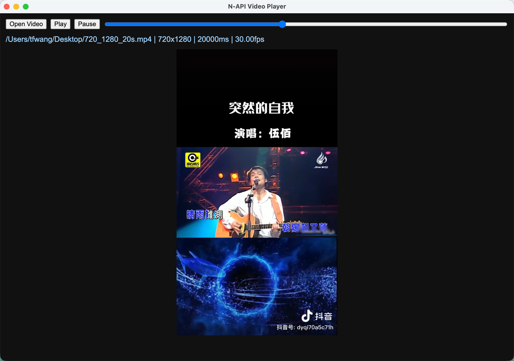

# ffmpeg-player N-API prototype

这是一个独立的 Node.js + N-API 原型工程。


## 能力

- `open(buffer)`：打开视频（内存 Buffer）
- `getInfo(handle)`：获取视频信息
- `decodeFrame(handle, ptsMs)`：按时间点解码一帧
- `seekFrame(handle, ptsMs)`：seek 并解码一帧
- `holdSeek(handle, seek)`：传递 seek 状态
- `close(handle)`：释放资源

返回的帧为 YUV420P 三平面 `Buffer`：`y/u/v`，同时返回 `lineY/lineU/lineV` 和 `width/height`。

## 依赖

你需要本机可链接的 FFmpeg 开发库（`avformat/avcodec/avutil/swscale`）。


## 构建

二选一（不要混用同一输出目录时记得先清理对应产物）：

| 命令 | 说明 |
|------|------|
| **`npm run build:gyp`** | `node-gyp` + **`binding.gyp`** |
| **`npm run build:cmake`** | CMake + **`CMakeLists.txt`**（需本机 **CMake 3.15+**） |

清理：

| 命令 | 说明 |
|------|------|
| **`npm run clean:gyp`** | `node-gyp clean` |
| **`npm run clean:cmake`** | 删除 **`build-cmake/`** 与根目录 **`compile_commands.json`** |

```bash
npm install
npm run build:gyp
# 或
npm run build:cmake
```

### CMake 补充说明

首次请 **`npm install`**（会安装 **`node-api-headers`**，供 CMake 找到 **`node_api.h`**）。

- 生成 **`build/Release/ffmpeg_player_napi.node`**（与 gyp 输出路径一致，`bindings` / `index.js` 可直接用）。
- 中间文件目录：**`build-cmake/`**。

macOS 下对 `.node` 使用 **`-undefined dynamic_lookup`**，使 `napi_*` 在加载时由 Node 解析；FFmpeg 静态库在 CMake 中额外链接了 **`libswresample`**（部分编解码器需要），与仅写四个 `-lav*` 时链接器自动解析的结果可能略有差异，但与本仓库自带的 `deploy/lib` 一致即可编过。

### IDE：`<napi.h>` 能否跳转 —— 和 CMake 原生项目的**关键差距**

编辑器（clangd / Microsoft C/C++）要能 **「转到定义」**，需要知道和**真实编译**一致的 **include 路径、宏、C++ 标准** 等。差距不在「有没有 `addon.cpp`」，而在**语言服务从哪儿读这些参数**。

| | **典型 CMake 项目**（如 `electron-rendering`） | **仅 node-gyp、未配 IDE 时** |
|---|-----------------------------------------------|-------------------------------|
| 编译描述 | `CMakeLists.txt` + **`CMAKE_EXPORT_COMPILE_COMMANDS ON`** | `binding.gyp`，**默认不产出** `compile_commands.json` |
| IDE 依据 | **`build/compile_commands.json`** 里每条源文件一条命令，含 **`-I.../node-addon-api`**、**`-I.../node-api-headers`** 等**绝对路径** | 语言服务**猜不到** gyp 传给编译器的完整 flags，`<napi.h>` 常变灰、无法跳转 |
| 结果 | `#include <napi.h>` **一点即开** | 易出现 **「找不到头文件 / 无法跳转」**（与代码是否正确无关） |

本仓库的**对齐方式**：用 CMake 生成 **`compile_commands.json`** 并复制到仓库根（**`npm run ide:compile-commands`** 或 **`npm run build:cmake`**），与 electron-rendering 一样，让 clangd / C++ 扩展按**真实编译命令**索引；根目录 **`.vscode/c_cpp_properties.json`** 指向该文件；**`.clangd`** 仅在尚未生成 `compile_commands.json` 时作兜底。

**你需要做的一次性步骤**：`npm install` 后执行 **`npm run ide:compile-commands`**（不必完整 `build:cmake` 链接），然后 **重载窗口** 或 **clangd: Restart**。**`compile_commands.json`** 已写入 `.gitignore`（含本机绝对路径，勿提交）。**Intel Mac** 请把 **`.vscode/c_cpp_properties.json`** 里的 **`macos-clang-arm64`** 改成 **`macos-clang-x64`**。

若仍无法跳转：确认 **`node_modules/node-addon-api`** 存在；**clangd** 与 **cpptools** 不要同时强占 C++ 语言服务。

## Electron 播放器（`napi/web`）


`napi/web` 下提供了一个 Electron 壳，流程是：

- Renderer: 控制 UI + Canvas(WebGL) 渲染 YUV
- Preload: 暴露受限 IPC API
- Main: 调用 N-API 解码并回传帧数据

运行方式：

```bash
npm install
npm run build:cmake
npm run electron
```

界面支持：

- 打开本地视频文件
- 播放 / 暂停
- 拖动进度条（内部走 `holdSeek + seekFrame`）
- 正常时间轴连续解码播放（`decodeFrame`）

## 运行示例

```bash
npm run demo -- /absolute/path/to/your.mp4
```

如果不传参数，默认读 `../res/640.mp4`。

## 在 Node 项目里调用

```js
const fs = require('fs')
const addon = require('./napi')

const video = fs.readFileSync('./640.mp4')
const { handle, info } = addon.openFromBuffer(video)
console.log(info)

const frame = addon.decodeFrame(handle, 0)
if (frame) {
  // frame.y frame.u frame.v are Buffers
}
addon.close(handle)
```

也可以用更简化的 JS 封装：

```js
const fs = require('fs')
const { NativePlayer } = require('./index')

const player = new NativePlayer()
player.openFromBuffer(fs.readFileSync('./640.mp4'))
const frame = player.decodeAt(1000)
player.close()
```

## 迁移说明

播放器与 N-API 绑定源码集中在 `src/core/`（解码、引导、资源释放、旋转等），FFmpeg 头文件与静态库在 `src/third-party/ffmpeg/deploy/`。  
迁移时保留 `src/core` 与 `src/third-party` 目录结构，并保证本机或目标环境能正确链接 FFmpeg 库即可。
